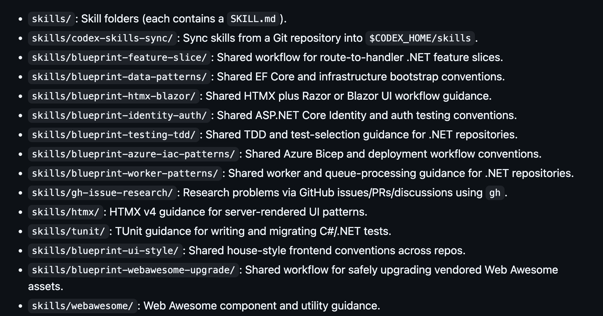

## Introduction

I have been writing software for years and, for much of that time, I treated the act of writing code as an important gateway to the understanding of the problem. Obviously there was planning, design, testing, reviewing, arguing with myself about naming, and staring into the middle distance wondering why the thing that should be simple is absolutely not simple. But at the end of it, _I_ wrote the code which gave me the assurance that _I_ understood the problem.

Increasingly, my work looks less like sitting down and typing every line myself and more like managing a very fast developer who has no long-term memory unless I deliberately create it. I spend more time deciding what should exist, why it should exist, where it should fit, what constraints matter, what standards apply, and how I will know when the work is actually done.

I do not mean this in the fluffy corporate way where "strategy" becomes an excuse to stop understanding the details. I mean that the non-coding, non-fingers-on-keyboard activities have become _even more vital_. It always was and always has been, in my opinion; look no further than me beating the drum of [mob programming](/blog/mobprogrammingjourney/) for years.

The code still matters. Of course it does. But the typing matters less than it ever has before.

## The Work Moved (And Didn't)

Software development has always involved more than writing code. The code is just the artifact we can point at most easily.

Before AI, a lot of the thinking could happen while writing. I would discover the shape of the problem as I typed. I would name something, hate the name, rename it, move a class, delete a method, add a test, realize the design was wrong, and circle back. The work was messy but the mess was slow enough that the act of doing it helped me keep the whole thing in my head.

AI changes that feedback loop because it can produce a lot of code before I have fully paid the cost of understanding it. That's both the benefit and the danger. The bottleneck moves from "can I type this fast enough?" to "did I define the work clearly enough and can I responsibly review what came back?"

The old failure mode was spending too much time typing boilerplate or grinding through repetitive changes. The new failure mode is accepting output that I do not really understand, which is worse. It is much easier to be honest about not having typed something yet than it is to be honest about not understanding something that is already sitting in a pull request looking finished.

When AI is involved, planning is not the boring pre-work before the real work starts. Planning, in the context of AI, _is_ the work. Deciding what not to build, naming the constraints, finding examples, writing acceptance criteria, and reviewing the diff are all part of development. If the plan is bad, the code will certainly be bad. It might compile and it might even pass tests, but it will be bad in the way software is often bad: incorrectly behaving, awkwardly placed, and expensive for the next person to understand.

That next person, these days, is [always me](https://blueprint.software).

## The Gap Gets Wider

One thing I think is becoming more obvious is that the categorization of "good devs" and "bad devs" is not going away, it's becoming even more pronounced.

The developers who were already good without AI are better with it. _Much much_ better with it. The ones who could reason about architecture, design, security, testing, operations, tradeoffs, and the shape of a system over time now have something like an exoskeleton. Or a third arm. Or whatever metaphor you want to use that does not make it sound like the tool is doing the thinking for them. It is not replacing their judgment; it is giving their judgment more reach.

That matters because the hard parts of software were never limited to typing code. A good developer could already look at a feature and ask whether it belonged in the system at all. They could smell when an abstraction was being introduced too early. They could think about how a decision would age, how it would be tested, how it would fail, and how another person would have to maintain it later. AI makes those people faster because they have something useful to aim the tool at.

The reverse is also true and I think this is where a lot of the danger sits. If someone was not good at decomposing work, understanding the domain, reviewing code, thinking about security, or maintaining a mental model, AI does not magically give them those skills. It may hide the absence of those skills for longer because the output looks professional. The code will compile. The PR will have a tidy summary and the implementation will be shaped like software. But the person driving still has to know whether it is the right software.

In the long term, I think this can make weak habits worse. If a developer uses AI to avoid understanding, they are not practicing the thing that would make them better. They are practicing delegation without judgment. That is not seniority; it is just moving faster with less friction between a vague idea and a bad implementation. I do not buy the idea that AI flattens engineering skill. It changes the shape of the work, but it does not remove the need to grow through the work. If anything, it makes the difference between "I can get code generated" and "I can responsibly build software" much easier to see.

Look at all the vibe coded disasters out there and come tell me that engineering has been "outsourced to AI". Those graphs showing that 90% of software engineering will be replaced by AI are claims I'm extremely skeptical about.

I was at a local .NET user group recently and the speaker (who was the wonderful [Scott Sauber](https://www.linkedin.com/in/scottsauber/)) said - and I'm paraphrasing - that the amount of software being created is higher than ever because of AI and that's probably a good thing for the profession. Already, I'm seeing small trends on LinkedIn and Bluesky of people saying "We're spending a lot of money on tokens and it's actually just more cost effective to hire junior devs" and I'm not even that connected to the job market.

## Planning the Work

The biggest change in my day-to-day development is that I try to decompose the work much more deliberately. I try to start by asking what problem I'm actually solving, what done looks like, what examples already exist, what should stay out of scope, and what would make me reject the implementation. I will use Codex on `High` or `Extra High` for this part with little care for token usage because everything that comes after this part is corrupted if this part is wrong.

This sounds obvious, but a lot of solo development lets you cheat on these questions. You can carry fuzzy intent in your head because you are the one translating the fuzz into code. AI does not work that way. If I hand it fuzz, it gives me fuzz with semicolons.

I can tell when I did not plan enough because the smell is immediate. I start a piece of work, get into the implementation, and suddenly I am asking a bunch of follow-up questions. Then I need another plan. Then I realize the original task was too big. Then I need to clarify the boundary between two concepts I should have separated earlier. Then I am backing up, re-prompting, re-reviewing, and trying to regain control of the shape of the work. A lot of the time I fail and I have to bail out. I'll ask it to give me a summary of where we are at and then restart with a new conversation.

That is usually not an AI problem. That is usually a me problem. It means I skipped decomposition, accepted a vague plan, or had not actually decided what I wanted. The AI simply made the ambiguity visible faster than I would have on my own. So now I treat excessive follow-up as a signal. If I need to keep stopping to ask "wait, what are we doing here?", the task probably needs to be cut smaller or planned better. There is no virtue in forcing the implementation forward when the shape of the problem is still blurry.

Tests are wonderful. I love tests. But tests prove the things they prove and nothing else. Passing tests do not mean the work belongs in the system. Passing tests do not mean the abstraction is good. Passing tests do not mean the names communicate the domain. Passing tests do not mean I still understand the software.

## Taste Versus Standards

This part has been hard for me because I have opinions. Lots of them. Some of them are even useful.

For a long time, I wanted code to look exactly the way I would have written it. Not just correct or maintainable, but _mine_. The names I would choose, the shape I would use, the level of abstraction I personally prefer, and the exact rhythm of the code I enjoy reading. That instinct does not scale very well with AI. It did not scale well with humans either as evidenced by things like `.editorconfig` files, Microsoft naming standards, VS/Rider specific configurations, and so on and so forth.

There is a difference between taste and standards. Taste is personal. Standards are shared. Taste says "I would not have written it that way." Standards say "this violates a rule we agreed matters." AI has forced me to get more honest about which is which. If I care about something repeatedly, I should probably encode it somewhere. In tests, analyzers, examples, documentation, repository instructions, reusable skills, or even in the shape of the codebase itself. If I am constantly correcting the same thing by hand, that is a sign the standard is not actually part of the system yet. It is just living in my head, charging rent.

There is also a new kind of standard that I did not think about much before:

> Can AI understand and safely modify this?

That does not mean making code simplistic or ugly. It means preferring structure that is obvious, local, consistent, and easy to navigate. The standard cannot simply be "make it look like Ben wrote it." That is not a standard. That is a dependency on me. The better standard is "make it obvious what problem this solves, keep related things close, follow the local patterns, prove the behavior, and leave the system easier to understand than you found it."

That is harder to express than a formatting preference, but it is much more valuable. I have found models are still a bit disappointing in this space, at least for my preferred language (.NET) and my standards. I've set up a vast array of skills, some of which encompass how I want my tests structured and outlined, to only good-enough results where I can have the model rework a few times to what I actually want.

## Skill Curation

One of the stranger changes is that I now think of AI instructions as an engineering artifact. Not a prompt I throw away after a conversation, not a clever trick, but an actual artifact that improves or decays over time. If a team has a way it likes to build features, that should be captured. If a repository has testing expectations, that should be captured. If there are architectural preferences, naming conventions, deployment concerns, review checklists, or common mistakes, those should be captured too.

In the past, a lot of this lived in people's heads. Or in code review comments. Or in messages nobody will ever find again. Or in the painful institutional memory of someone saying, "Oh yeah, don't do it that way because three years ago we learned..." AI makes that more expensive.

If the instructions are not explicit, the model will infer. Sometimes it will infer correctly. Sometimes it will confidently import a pattern from a different universe and make it look plausible enough that I have to slow down and untangle it.

Skill curation is the act of turning repeated judgment into reusable guidance. How should a new feature be structured? What kind of tests should be written? When do we prefer integration tests over mocks? What does "done" mean in this repository? What patterns should be avoided? What should a reviewer pay special attention to? This is not busywork. This is leverage.

The better the skills and instructions are, the less time I spend repeatedly steering AI away from the same ditch. More importantly, the work becomes less dependent on me remembering every preference in the moment. For example, I really like my `Bicep` and `YAML` parameters to be alphabetical. Before AI, I'd spend a non-trivial amount of time making sure they were all following that standard. AI just does it now without me thinking about it - it's something that is harder for a linter or script to detect since YAML and Bicep files are unstructured and parameters can be nested deep in files.

Some useful skills I've curated in a repo I use for Blueprint are below:

## The Mental Model Problem

The scariest part of AI-assisted development is not that it writes bad code. Developers write bad code all the time. I have personally contributed a heroic amount of it to the world - my own personal un-AI-assisted slop.

The scariest part is that AI can write code quickly enough that I can lose my mental model of the system while still feeling productive. That is dangerous because there is a huge difference between "the change is done" and "I understand the change." I need to know where the code fits. I need to understand why it was written that way. I need to know what tradeoffs were made. I need to know what behavior is covered by tests and what behavior is merely assumed. I need to be able to explain the data flow without waving my hands. If I cannot explain it, I do not own it.

That does not mean I need to personally type every line. It does mean I need to read enough, ask enough, and test enough that the system is still in my head. This requires discipline because AI makes it easy to move on too quickly. The output looks finished, the diff is there, all the tests pass, the summary sounds reasonable. The temptation is to say, "Great, next thing," but what I should be saying is "Can I explain this?"

If the answer is no, the work is not done.

## Wrap Up

I do not think AI makes developers less responsible. I think it makes irresponsibility faster. AI can help me do an enormous amount of useful work, but it can also help me generate an enormous amount of plausible nonsense. The difference is not the tool. The difference is the discipline around the tool. It always has been, but the feedback loop is vastly accelerated.

The job is shifting. I write less of the code by hand than I used to. I spend more time planning, decomposing, reviewing, curating standards, and maintaining the mental model of the system. That does not feel like a demotion from "real development" to something adjacent to development. It feels like the real work got more exposed. The work of "systems thinking" - how a change affects the system as a whole - is more visible than it has ever been before.

The typing was never the valuable part by itself. The valuable part was understanding the problem, making good decisions, and leaving behind software that other people can safely change.
